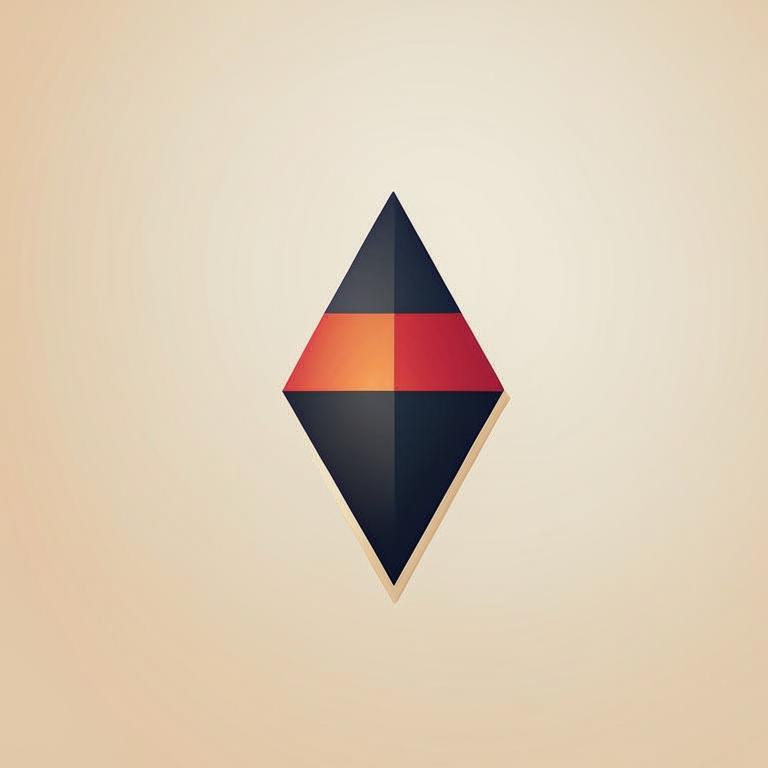

<a id="readme-top"></a>

[![Contributors][contributors-shield]][contributors-url]
[![Forks][forks-shield]][forks-url]
[![Stargazers][stars-shield]][stars-url]
[![Issues][issues-shield]][issues-url]
[![Unlicense License][license-shield]][license-url]


<!-- PROJECT LOGO -->
<br />
<div align="center">
  <a href="https://github.com/kretoffer/AI-phrase-classifier">
    
  </a>

  <h2 align="center">AI-phrase-classifier</h2>

  <p align="center">
    Intelligent message classifier that determines the message class and highlights entities
    <br />
    <a href="https://github.com/kretoffer/AI-phrase-classifier/tree/main/docs"><strong>Explore the docs »</strong></a>
    <br />
    <br />
    <a href="https://github.com/kretoffer/AI-phrase-classifier">View Demo</a>
    &middot;
    <a href="https://github.com/kretoffer/AI-phrase-classifier/issues/new?labels=bug&template=bug-report---.md">Report Bug</a>
    &middot;
    <a href="https://github.com/kretoffer/AI-phrase-classifier/issues/new?labels=enhancement&template=feature-request---.md">Request Feature</a>
  </p>
</div>


<!-- TABLE OF CONTENTS -->
<details>
  <summary>Table of Contents</summary>
  <ol>
    <li>
      <a href="#about-the-project">About The Project</a>
      <ul>
        <li><a href="#built-with">Built With</a></li>
      </ul>
    </li>
    <li><a href="#installation">Installation</a></li>
    <li>
      <a href="#usage">Usage</a>
      <ul>
        <li><a href="#launch-with-docker">Launch with docker</a></li>
        <li><a href="#launch-without-docker">Launch without docker</a></li>
      </ul>
    </li>
    <li><a href="#roadmap">Roadmap</a></li>
    <li><a href="#license">License</a></li>
    <li><a href="#contributing">Contributing</a></li>
  </ol>
</details>


<!-- ABOUT THE PROJECT -->
## About The Project
The project aims to create an open-source message classifier with flexible configuration, the ability to work on a processor and video card, the ability to run it both locally and use a cloud solution. AI-phrase-classifier must classify the message and extract entities.

### Demo


### Built With

The classifier is developed in python using the spacy library for extract entities in phrases and the sklearn library for classification phrases. Interaction occurs via the http protocol using the fast api framework

* 
* 
* 
* 

<p align="right">(<a href="#readme-top">back to top</a>)</p>


## Installation
For install classifier run in terminal (you need a git)
```sh
git clone https://github.com/kretoffer/AI-phrase-classifier
cd AI-phrase-classifier
```

## Usage
### Launch with docker
To launch a project via docker you will need [docker](https://docs.docker.com/)
```sh
docker build . -t classifier
docker run -d -p 8585:8585 classifier
```
Or by connecting the directory in which the dataset and trained models are stored
```sh
docker build . -t classifier
docker run -d -p 8585:8585 -v "/home/{user}/AI-phrase-classifier-data:/AI-phrase-classifier-data" classifier
```
### Launch without docker
To launch a project without docker you need a python

#### Preparation:
```sh
python -m venv .venv
source .venv/bin/activate
pip install -r requirements.txt
```
#### Run
```sh
source .venv/bin/activate
python main.py
```


<!-- ROADMAP -->
## Roadmap

See the [open issues](https://github.com/kretoffer/AI-phrase-classifier/issues) for a full list of proposed features (and known issues).

<p align="right">(<a href="#readme-top">back to top</a>)</p>


<!-- LICENSE -->
## License

Distributed under the Unlicense License. See `LICENSE` for more information.

<p align="right">(<a href="#readme-top">back to top</a>)</p>


<!-- CONTRIBUTING -->
## Contributing

Contributions are what make the open source community such an amazing place to learn, inspire, and create. Any contributions you make are **greatly appreciated**.

If you have a suggestion that would make this better, please fork the repo and create a pull request. You can also simply open an issue with the tag "enhancement".
Don't forget to give the project a star! Thanks again!

1. Fork the Project (`git clone https://github.com/kretoffer/AI-phrase-classifier.git`)
2. Create your Feature Branch (`git checkout -b feature/{name of feature}`)
3. Commit your Changes (`git commit -m 'Add some {name of feature}'`)
4. Push to the Branch (`git push origin feature/{name of feature}`)
5. Open a Pull Request

### Top contributors:

<a href="https://github.com/kretoffer/AI-phrase-classifier/graphs/contributors">
  
</a>

<!-- MARKDOWN LINKS & IMAGES -->
<!-- https://www.markdownguide.org/basic-syntax/#reference-style-links -->
[contributors-shield]: https://img.shields.io/github/contributors/kretoffer/AI-phrase-classifier
[contributors-url]: https://github.com/kretoffer/AI-phrase-classifier/graphs/contributors
[forks-shield]: https://img.shields.io/github/forks/kretoffer/AI-phrase-classifier.svg?style=flat
[forks-url]: https://github.com/kretoffer/AI-phrase-classifier/network/members
[stars-shield]: https://img.shields.io/github/stars/kretoffer/AI-phrase-classifier.svg?style=flat
[stars-url]: https://github.com/kretoffer/AI-phrase-classifier/stargazers
[issues-shield]: https://img.shields.io/github/issues/kretoffer/AI-phrase-classifier.svg?style=flat
[issues-url]: https://github.com/kretoffer/AI-phrase-classifier/issues
[license-shield]: https://img.shields.io/github/license/kretoffer/AI-phrase-classifier.svg?style=flat
[license-url]: https://github.com/kretoffer/AI-phrase-classifier/blob/master/LICENSE