# Training the classifier

## Getting started with the classifier
AI-phrase-classifier is an open source classifier that runs locally and has a user-friendly interface for training your system.

To start working with this service you need to [install](https://github.com/kretoffer/AI-phrase-classifier?tab=readme-ov-file#installation) and [launch](https://github.com/kretoffer/AI-phrase-classifier?tab=readme-ov-file#usage) it, after which go to `localhost:8585`.

After this we create a new application:

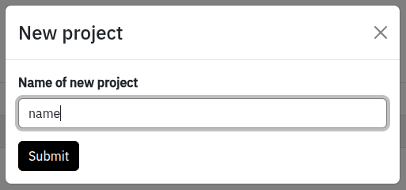

## Description of working with the classifier

You can see its settings in the project management menu. There are two buttons, one of which switches us to the editing mode, and the second starts training.

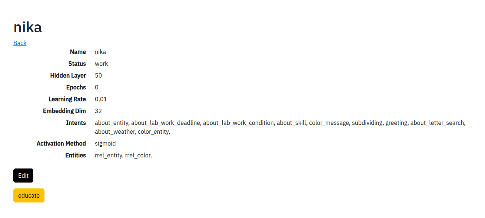


### Edit mode
General section. Here you can change project settings, such as the number of neurons in the hidden layer, the number of training epochs, activation functions, etc.

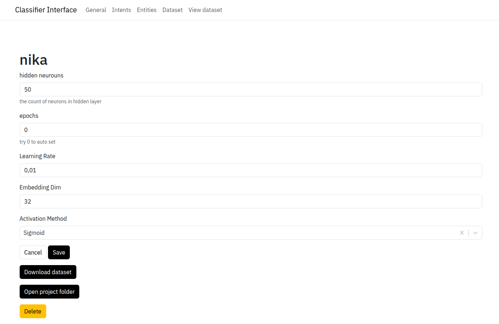

Intents section. This is where you create the message classes.

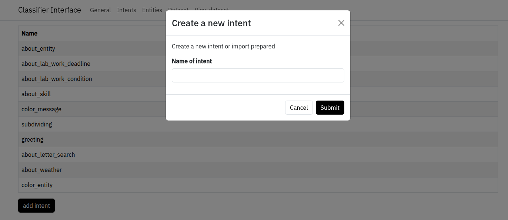

The Entities section. This is where you create the entity classes.

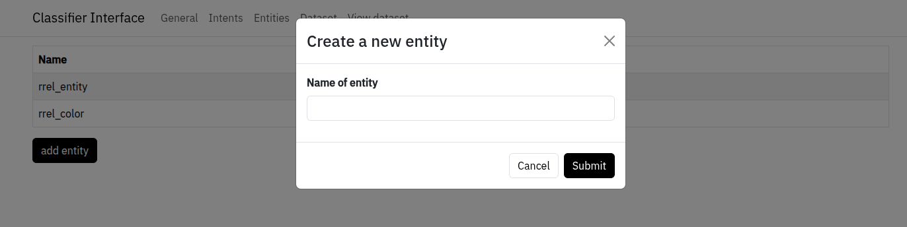

Dataset section. Here you train your application to classify messages and extract entities. You need to enter messages that you want to train the system in the input field and then manually extract the question class and entities, thereby creating a dataset. After that, you can click the training button in the main project menu.

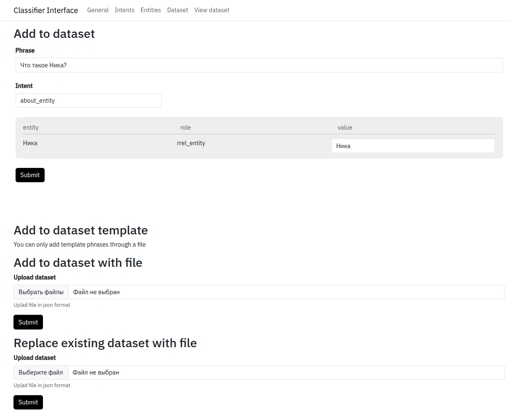

View dataset section. Here you can view the questions asked and correct them if necessary.

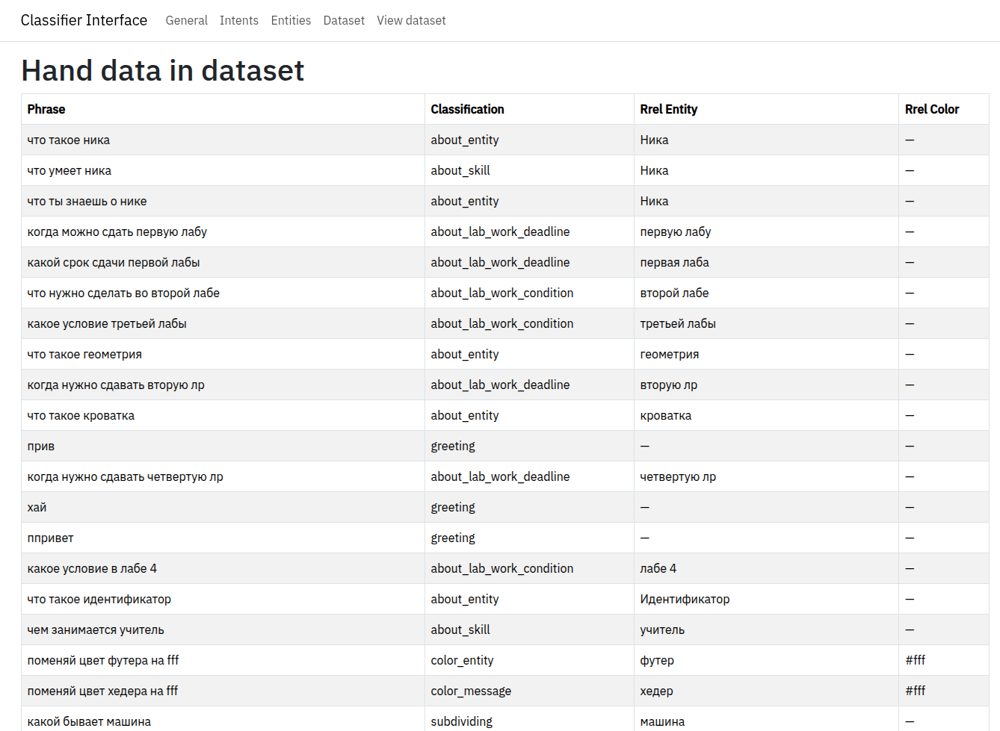

## Classifier training via graphical interface
Currently, the graphical interface only allows updating [hand part of the dataset](https://github.com/kretoffer/AI-phrase-classifier/tree/main/docs/dataset.md)
### Hand part of the dataset
First, you need to open the classifier's graphical interface in edit mode on the Dataset section.

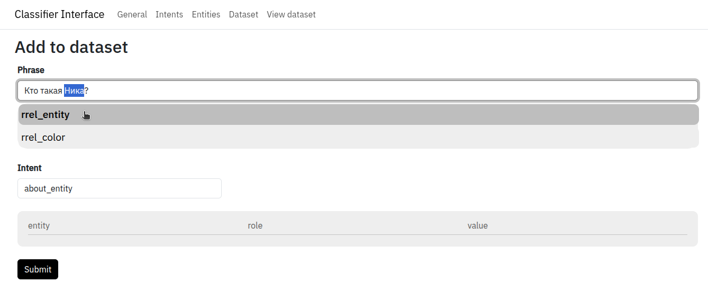

In the phrase field, enter the phrase you want to teach the classifier. In the intent field, select the message class. The class can be selected from those previously added in the Intents section. If the phrase contains entities, then you need to select the entity and select the entity class from the menu that appears. If the name of the entity in the phrase is not written in the form in which the classifier should output, then the correct form can be written in the value line of the table with entities.

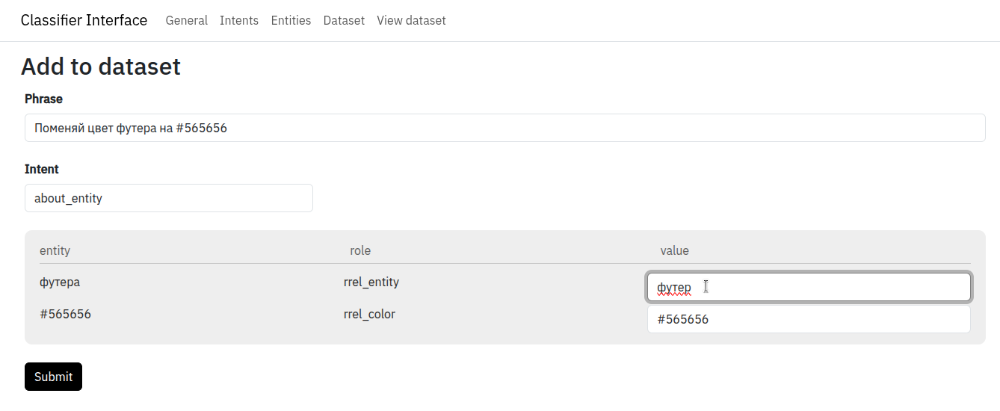

The procedure must be repeated for each entity in the phrase, after which click the Submit button.

#### Note
There can only be one entity of one class in one phrase. If you need to select two entities, you must use two different entity classes.<br>
All phrases of one message class must have the same entity types. For example, if one phrase about_entity contains an entity of the rrel_entity type, then the entity of this type must be in all phrases of this class.<br>
These notes are also relevant for updating the dataset via a file and a template.

### Template part of the dataset
To begin, you need to enter a phrase in the phrase field and click the "Add +" button. The phrase must be entered in lower case and without special characters. The phrase can contain variables, which are designated as $`<entity name>`. During training, entities take the place of variables. Afterwards, you need to add the corresponding entities to the fields with entities, as well as phrases.

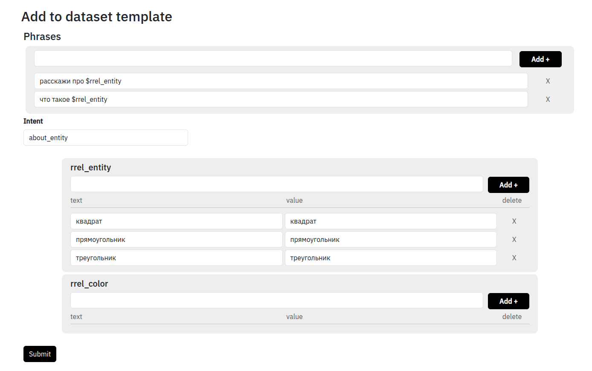

This example looks like this in the dataset:

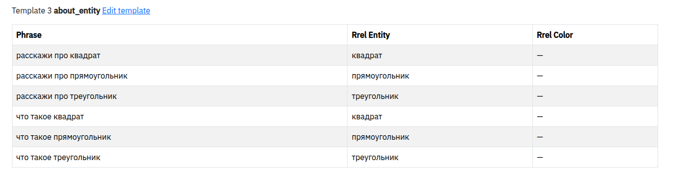

There are cases when the word that should be in the phrase and the word that the classifier should determine are different. For example, the phrase "change footer color to `565656`", and the classifier should return `#565656`. In this case, in the second field of the entity, called `value`, you need to enter the word that you want to receive from the classifier.

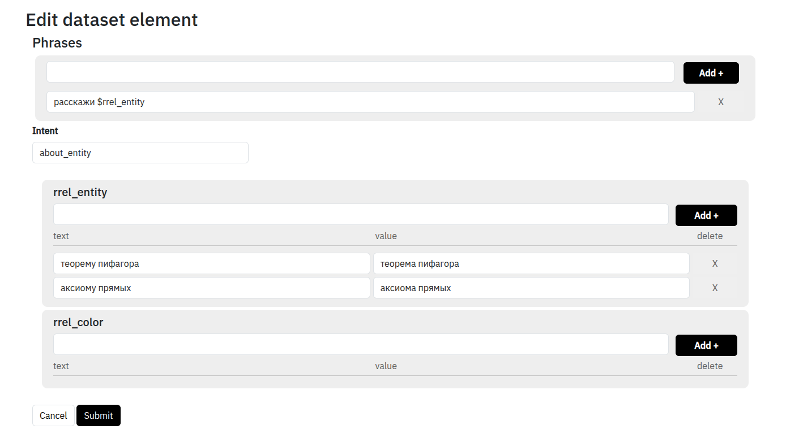

This will look like this in the dataset:

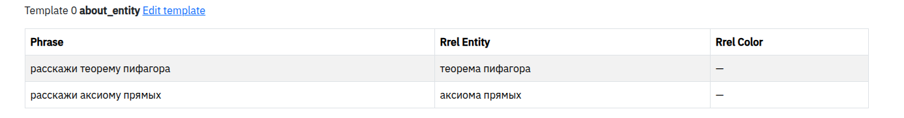

## Training the classifier via a dataset file
You can also train the classifier via a dataset file. You can take it either from the project directory, which you can get to using the Open project folder button in the general settings section, or by clicking the Download dataset button in the general settings section. You can learn about the structure of the dataset [here](https://github.com/kretoffer/AI-phrase-classifier/tree/main/docs/dataset.md)

After adding a dataset file, you can upload it in the Dataset section via "Replace existing dataset with file". If the dataset file was written from scratch and needs to be added to the one in the system, you need to upload it via "Add to dataset with file".

#### Note
The dataset file must have the .json extension, otherwise the form in the graphical interface will not accept it.

## At the end of editing the dataset, you need to go to the main page of the project and click the Educate button.

The classifier is launched locally, which allows you to work with it in the absence of the Internet, use it for confidential data, change dataset files using automation scripts.

# API
To use the classifier, you need to send a GET request to the url ```localhost:8585/api/message/{project}?q={phrase}```, where instead of project you specify the name of your application that you created, and in phrase you pass the phrase itself for classification.
### Exemple
request
```http get
http://localhost:8585/api/message/nika?q=What is a Nika? 
```
response
```http response
{"intent":"about_entity","entities":[{"rrel_entity":"Nika"}]}
```