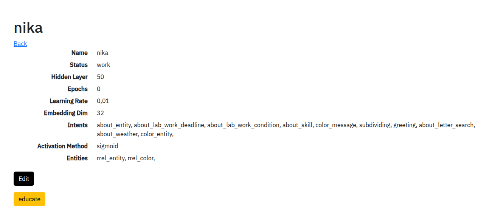
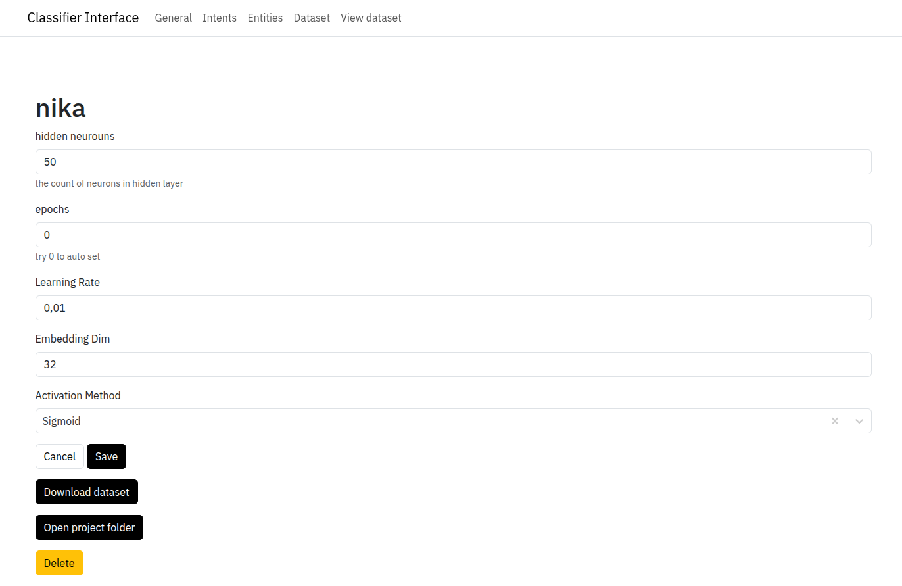
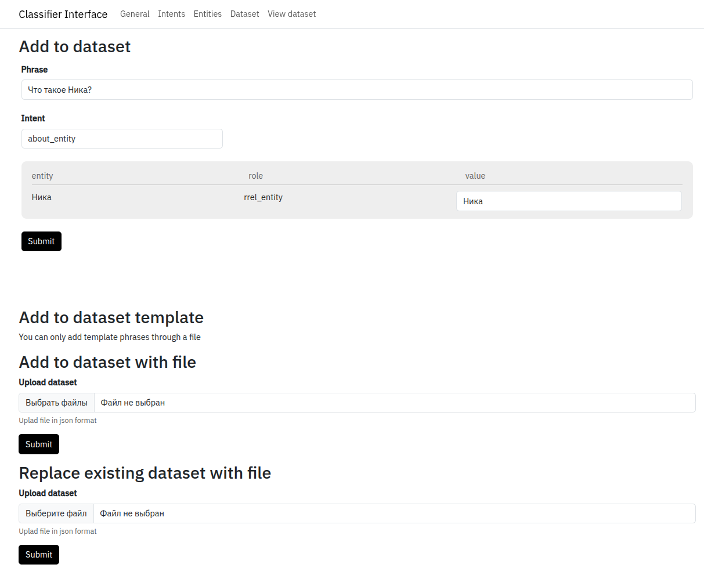
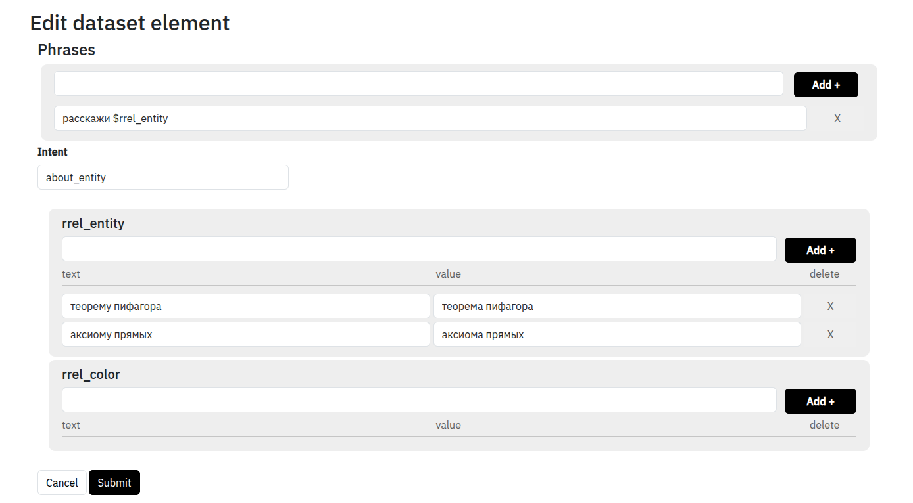
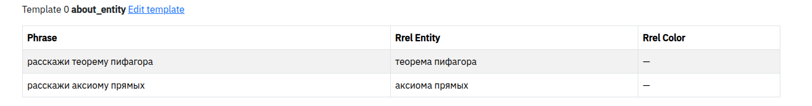

# Обучение классификатора

## Начало работы с классификатором
AI-phrase-classifier - это классификатор с открытым исходным кодом, запускающийся локально, имеющий удобный интерфейс для обучения вашей системы.

Для начала работы с данным сервисом нужно его [установить](https://github.com/kretoffer/AI-phrase-classifier?tab=readme-ov-file#installation) и [запустить](https://github.com/kretoffer/AI-phrase-classifier?tab=readme-ov-file#usage), после чего перейти на `localhost:8585`.

После этого создаем новое приложение:


## Описание работы с классификатором

В меню управления проектом можно увидеть его настройки. Там есть две кнопки одна из которых переводит нас в режим редактирования, а вторая запускает обучение.




### Режим редактирования
Раздел General. Эдесь можно изменить настройки проекта, такие как количество нейронов скрытого слоя, количество эпох обучения, функции активации и прочего.



Раздел Intents. Тут создаются нужные вам классы сообщений.


Раздел Entities. Тут создаются нужные вам классы сущностей.


Раздел Dataset. Здесь вы обучаете ваше приложение классифицировать сообщение и выделять сущности. Нужно вводить сообщения, которым вы хотите обучить систему, в поле для ввода и затем вручную выделять класс вопроса и сущности, тем самым одновляяя датасет. После чего можно нажать кнопку обучения в главном меню проекта.



Раздел View dataset. Здесь можно просматривать заданные вопросы и исправлять их при необходимости


## Обучение классификатора через графический интерфейс
### Ручная часть датасета
Для начала нужно открыть графический интерфейс классификатора в режиме редактирования на вкладке Dataset.


В поле phrase вводится фраза, которой вы хотите научить классификатор. В поле intent нужно выбрать класс сообщения. Класс можно выбрать из тех, которые до этого были добавлены в разделе Intents. Если в фразе есть сущности, то нужно выделить сущность и из появившегося меню выбрать класс сущности. В случае если название сущности в фразе написано не в той форме, в которой должен выдавать классификатор, то правильную форму можно написать в строке value таблицы с сущностями.


Процедуру нужно повторить для каждой сущности в фразе, после чего нажать на кнопку Submit.

#### Примечание
В одной фразе может быть только одна сущность одного класса. Если нужно выделить две сущности, нужно использовать два разных класса сущностей.<br>
Во всех фразах одного класса сообщений должны быть одинаковые типы сущностей. Например если в одной фразе about_entity будет сущность типа rrel_entity, то сущность этого типа должна быть во всех фразах этого класса.<br>
Данные примечания актуальны и для обновления датасета через файл и шаблон.

### Шаблонная часть датасета
Для начала в поле phrase нужно ввести фразу и нажать кнопку "Add +". Фраза должна вводится в нижнем регистре и без спец символов. Фраза может содержать переменные, которые обозначаюся, как $`<entity name>`. Во время обучения на место переменных становятся сущности. После, в поля с сущностями нужно добавить соответствующие сущности,так же, как и фразы.


Данный пример выглядит в датасете так:


Есть случаи, когда слово которое должно быть в фразе и слово которое должен определить классификатор отличаются. Например, фраза "Расскажи `теорему пифагора`", а классификатор должн вернуть `теорема Пифагора`. В таком случае, во второе поле сущности, под названием `value` нужно ввести слово, которое вы хотите получать от классификатора.



Это будет выглядеть в датасете, как:



## Обучение классификатора через файл датасета
Обучать классификатор также можно через файл датасета. Его можно взять либо в директории проект, в которую можно попасть с помощью кнопки Open project folder в разделе генеральных настроек, либо сказать по кнопке Download dataset в разделе генеральных настроек. Узнать о структуре датасета можно [здесь](https://github.com/kretoffer/AI-phrase-classifier/tree/main/docs/dataset.ru.md)

После дополнения файла датасета его можно выгрузить в разделе Dataset через "Replace existing dataset with file". Если же файл датасета был написан с нуля и его нужно дополнить к тому который есть в системе, то нужно выгружать его через "Add to dataset with file". 

#### Примечание
Файл датасета должен быть с расширением .json, иначе форма в графическом интерфейсе его не примет.

## В конце редактирования датасета нужно перейти на главную страницу проекта и нажать кнопку Educate.

Классификатор запускается локально, что позволяет работать с ним в условиях отсутсвия интернета, использовать для конфиденциальных данных, менять файлы датасета с помощью скриптов автоматизации.

# API
Для использования классификатора нужно отправить GET запрос по url ```localhost:8585/api/message/{project}?q={phrase}```, где вместо project указывается имя вашего приложения, которое вы создали, а в phrase передается сама фраза для классификации.
### Пример
Запрос
```http get
http://localhost:8585/api/message/nika?q=Что такое классификатор?
```
Ответ
```http response
{"intent":"about_entity","entities":[{"rrel_entity":"классификатор"}]}
```